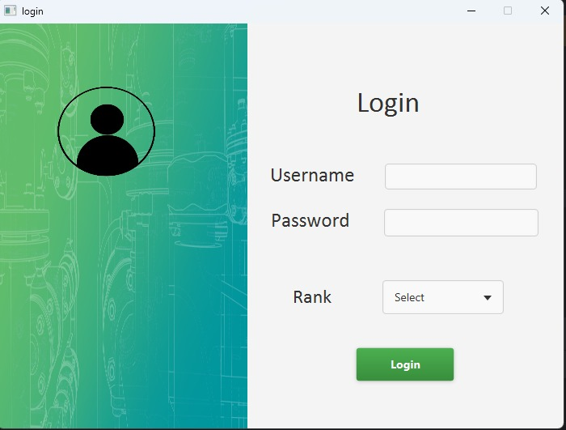
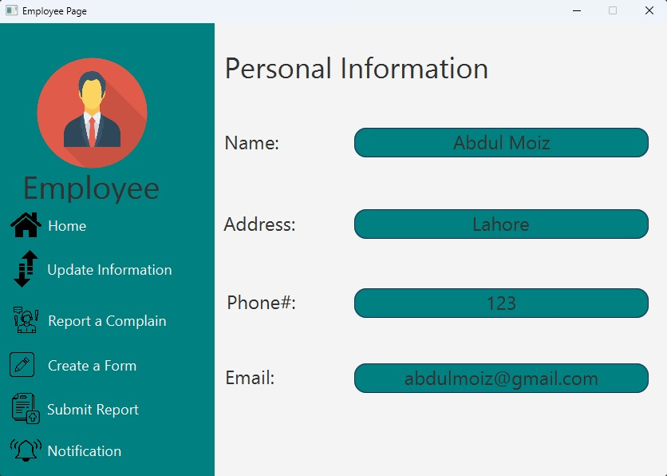
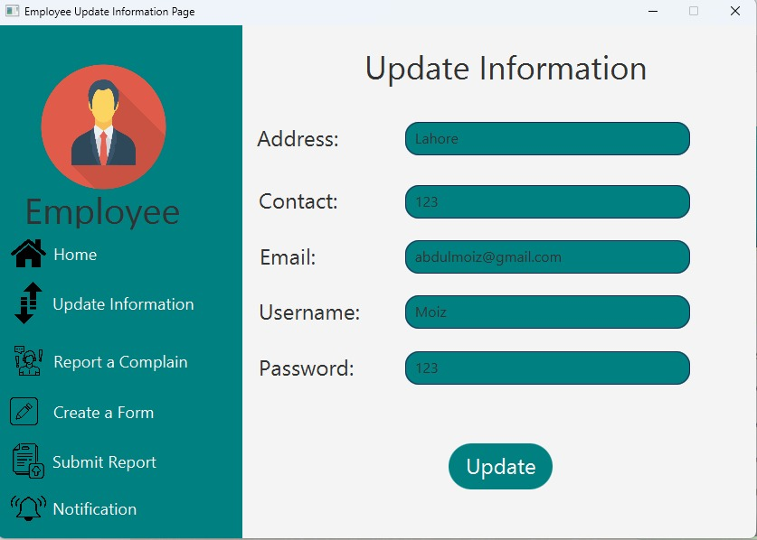
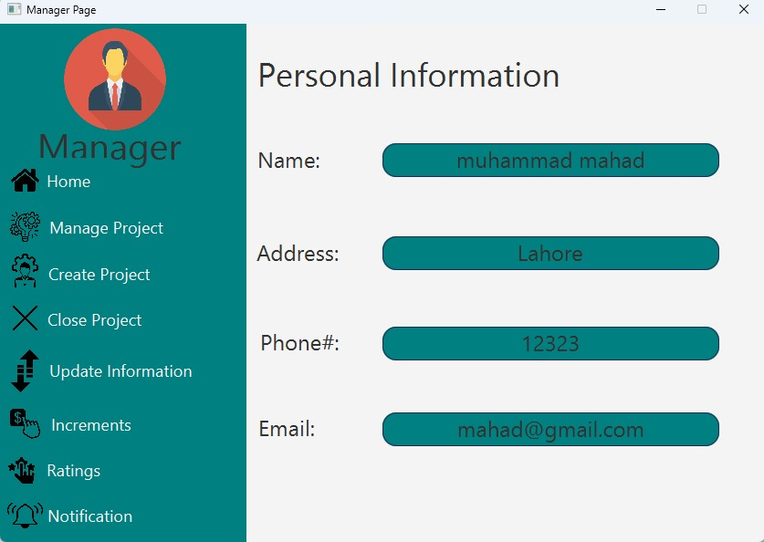
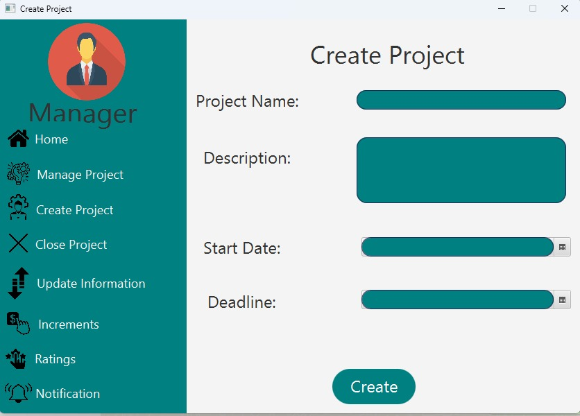
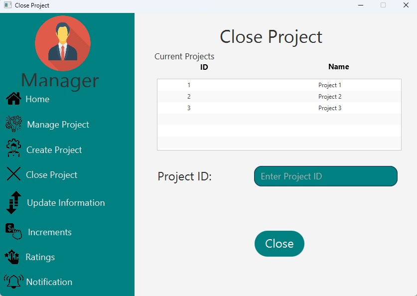
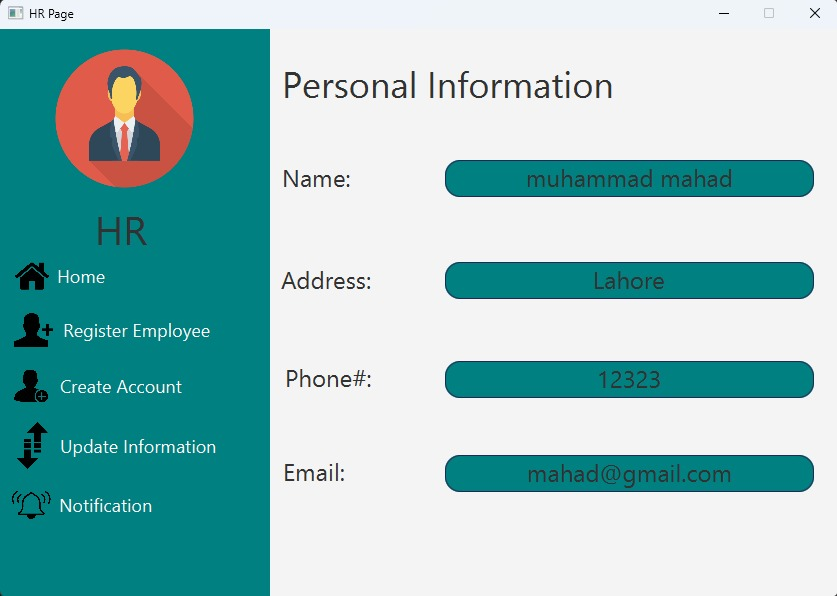
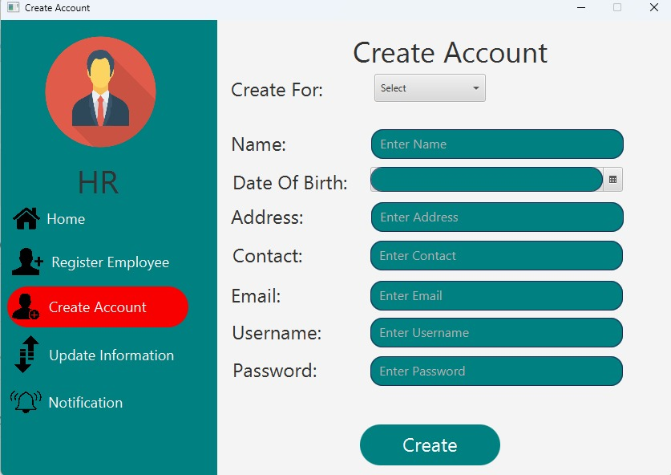

# CORP (Corporate Management System)
## How to run:
- We have built this application on IntelliJ IDEA IDE. 
    - To run this application, you need to have JavaFX installed on your system. You can download it from [here](https://gluonhq.com/products/javafx/). 
    - After installing JavaFX, you need to add it to your project. 
- We have used mysql database for this project. 
    - You need to install mysql on your system. You can download it from [here](https://dev.mysql.com/downloads/mysql/).
    - After installing mysql, you need to create a database named `corp` and then import the [`corp.sql`](src/main/java/com/example/sdacorp/mysql.sql) file in it. 
    - After importing the database, you need to change the username and password in the `DatabaseConnection.java` file.

## Objective:
This project aims to improve the efficiency and productivity of employee management in a
corporate environment. It allows the user to store and update the employee's personal
information, skills, and performance. Moreover, it integrates a project management system that
enables the user to assign tasks, monitor progress, and meet deadlines with ease. This project
is relevant and fills the market gap as industry-leading software solutions like ClickUp and Jira
actively employed in this field validate the significance and usefulness of this project.

## Motivation & Outcomes:
The main goal of this project is to enhance the user experience of corporate people by
integrating the project management tools with the formal employee management system
● Providing the manager with a rich experience and tools to manage the employees'
personal information, performance and skills effectively.
● It will also facilitate effective corporate project management, including task delegation
and allocation to potential employees.
● Furthermore, Creating a one-stop platform for employees to access all their professional
work-related information.
● This project enables employees to concentrate on project work rather than the intricacies
of project and personnel management, fostering synchronization among team members.

## Deliverables & Modules:
Our project contains the following modules which helps the project managers to effectively
manage their employees.

### Personal information management:

Our foremost objective is the efficient management of employee personal data,
encompassing the ability to add new employee information and allowing employees to
update their details. This system also includes a section for monitoring employee mental
health status and well being.
 
### Professional information management:

Another goal of this project is to create a one-stop dashboard for employees to
view and edit their professional information. This includes their designation, role,
responsibilities, work experience, performance rating, and interpersonal skills. The
dashboard also shows if the employee is eligible for any bonus or recognition.

### Project Management:

Additionally, this project enables employees and managers to handle their
projects efficiently. It offers insights into employee availability, task completeness, and
track project deadlines. Managers can assign specific projects to individual employees,
ensuring organized project execution.

### Unique Feature:

One of our standout features is the ability for managers to identify employees
with specific skill sets, enhancing project efficiency by pairing them with the most
suitable team members. This feature also integrates a rating system to monitor
employee progress and determine whether they qualify for yearly bonuses or special
recognition rewards.

## Technology Stack:
- Frontend: Javafx
- Backend: Java

### Demo of the project:
       